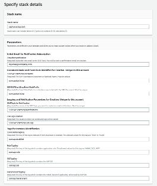

# SAP on HANA on Linux Stop/Start Document and Operations framework

## Description

This CloudFormation Template will deploy the following elements to enable a step by step stop or start of an SAP application and the EC2 instances on which it is hosted.

For more details on its usage see the blog.

**SSM Automation Document (Runbook)**

  The runbook takes the parameters SAP SID and an action (Stop or Start), the AWS systems manager runbook will run through a series of steps to Stop or Start the SAP application, Hana Database and EC2 Instances. The supported architectures cover single instance, semi distributed or distributed running HANA in a single tenant scale-up deployment.

**EventBridge Rules for Document Completion and Step Failure**

Eventbridge rules are created to push details of success or failure to the SNS topic on completion of the automation document as well as for a specific step which fails. The notification output is parsed to form a link which will take you directly to the automation document contents.

**SNS Topic**

An SNS topic is created as a recipient for EventBridge Rules. The CloudFormation document requires an email address as the first subscription. Additional emails can then be added.

**A CloudWatch Logs Log Group**

This is not created by the Cloudformation, but defined as a destination for runCommand logs to ensure these are not truncated by the character limit of Systems Manager. Consider adjusting the retention on this group.

**Not created**

An IAM Role - Ensure the use of least privilege

## Installation

1. In CloudFormation, select Create Stack and populate the required parameters or leave them as the defaults, ensuring that they are unique in your account. You will need a unique name and an email address.
Once complete. Select _Next_, then under configure stack options select _Next_, review the inputs and select _Create Stack_.
Note: If you are redeploying this template, consider deleting old stacks.

2. Subscribe to the email which should arrive in your inbox to receive notifications.

3. Check all instances are configured as targets for for [Systems Manager Automation](https://docs.aws.amazon.com/systems-manager/latest/userguide/systems-manager-setting-up.html) on EC2 instances including the appropriate instance roles.

4. Setup tags to enable and identify the instances, according to the naming standard defined when you created the stack. Note: the Cloudformation is setup to allow the definition of a different set of tags, but using a prefix like “ssmsap:” clearly identifies a purpose for the tags and will reduce the likelihood of unrelated changes.
These tags can be added manually to the EC2 Instance tab in the console, or incorporated in your infrastructure deployment templates.

## Usage

Under Systems Manager > Automation. Select Execute Automation and find the document under “Owned by me”. Familiarise yourself with the document by reading through the document and step descriptions.

Execute the automation document. We suggest starting with a simple execution, but it is also possible to run parallel documents for multiple SIDs using the rate control option.

Select a role which can be used to execute the automation, or leave blank to execute as the current role. Select an operation and the SAP SID(not the HANA SID) of the system you wish to stop or start.

Monitor the progress. Note: not all steps are run (stop steps for stop, start steps for start). The execution may expand over multiple pages. The overall status section will let you know whether the document is finished. You should also receive an email with a link back to this section in the console. Select the Step ID for more details on the error (if applicable).

Check SAP connectivity or Instance Status to ensure the Runbook status matches with that of the SAP system.
